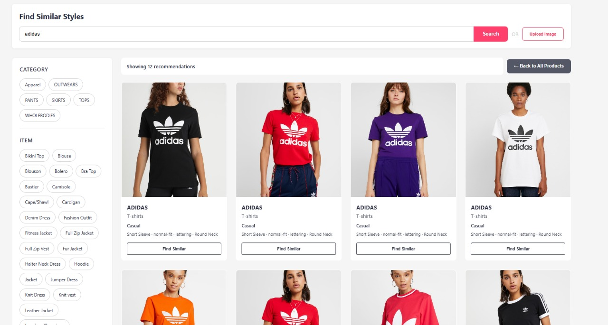
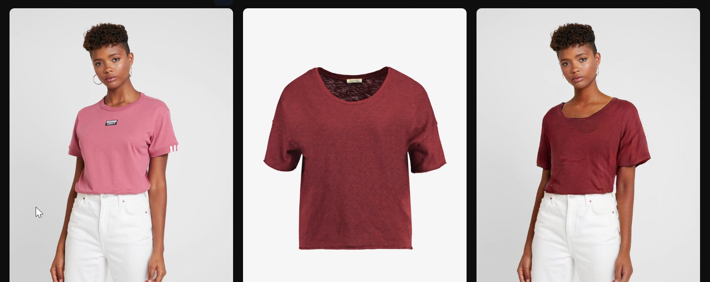
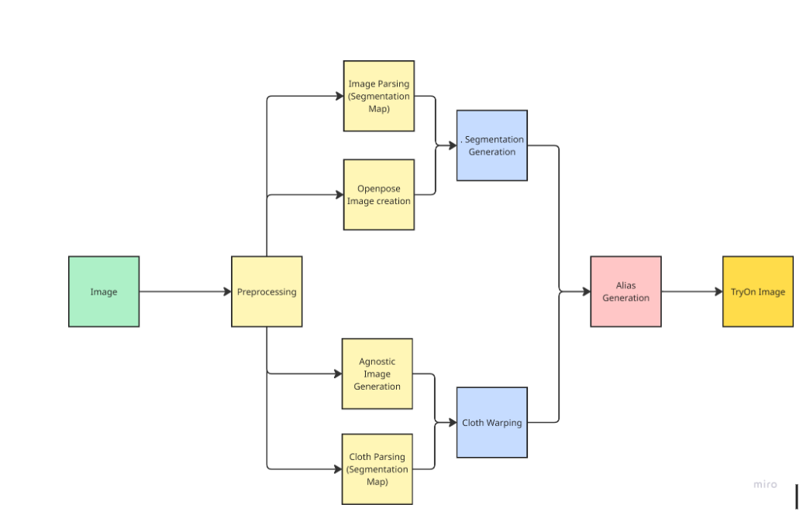

# FabrIQ
FabrIQ is an AI-driven fashion intelligence platform that integrates virtual try-on, garment styling, and multimodal recommendation systems. The system leverages state-of-the-art deep learning models to offer personalized and visually accurate fashion experiences.

# Virtual Try-On (VTO)
FabrIQ's virtual try-on module is based on the **VITON-HD architecture**. Research Paper - [(link)](https://arxiv.org/abs/2103.16874). Official PyTorch Implementation - [(link)](https://github.com/shadow2496/VITON-HD) It generates high-resolution, photorealistic images of a person wearing a selected garment, while preserving body shape, pose, and clothing texture.

## Core Components
Person-Cloth Synthesis: The system synthesizes realistic try-on images using person-specific information such as segmentation masks, pose estimation, and garment masks.

Three-Stage Pipeline:

**Segmentation (Human Parsing)**: Extracts semantic segmentation maps to identify body parts and clothing regions.

**Geometric Matching Module (GMM)**: Warps the garment to align with the target body shape and pose using thin-plate spline transformations.

**ALIAS Generator**: Fuses the warped garment with person features to generate the final high-quality try-on output.

# Styling Module
A suite of deep learning-based tools for garment customization and content transformation.

Features
Neural Style Transfer
Applies the texture and visual characteristics of a reference image (style) to a target clothing image, allowing for unique stylized outputs.

Logo Imprint Generator
Projects logos or graphical patterns onto garments using pixel-level blending and refinement models to ensure natural integration with folds and contours.

Cloth-to-Cloth Style Transfer
Transfers visual features such as color schemes, texture, and material appearance from one clothing item to another, while preserving garment shape and silhouette.

# Recommender System
A hybrid recommendation engine that combines visual-semantic embedding and graph-based user-item modeling to suggest relevant fashion items.

Modules
Image-to-Image Recommendation
Utilizes OpenCLIP to encode visual content into embeddings. Similarity is computed in the latent space to recommend visually related garments and accessories.

Text-to-Image Recommendation
Natural language descriptions are embedded using CLIP’s text encoder and matched against the visual embeddings of fashion items, enabling semantic search and discovery.

Graph-Based Fashion Recommendation
Employs a Graph Neural Network (GNN) model built on user-item interaction data, item similarity graphs, and historical co-occurrence patterns to provide personalized and context-aware recommendations.

